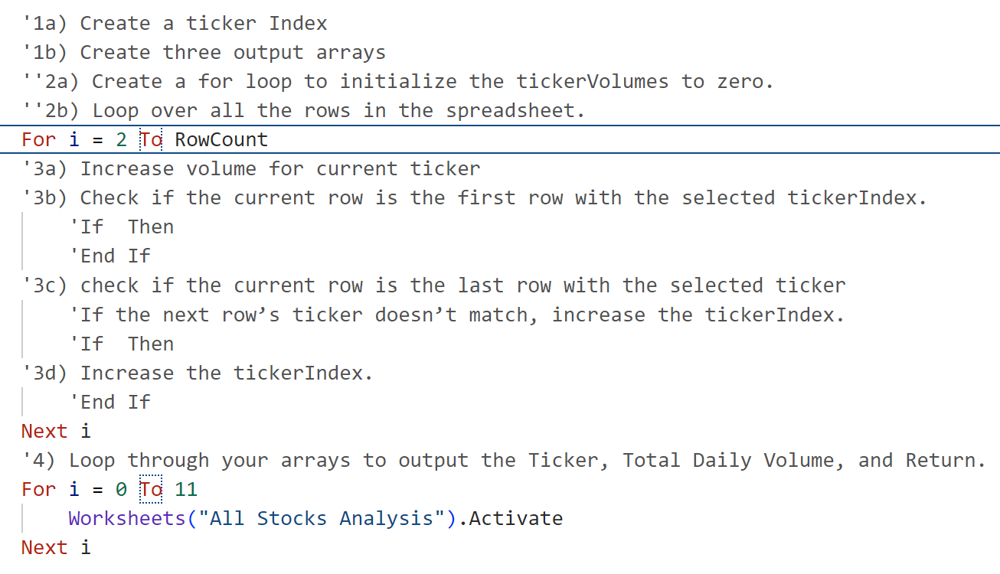
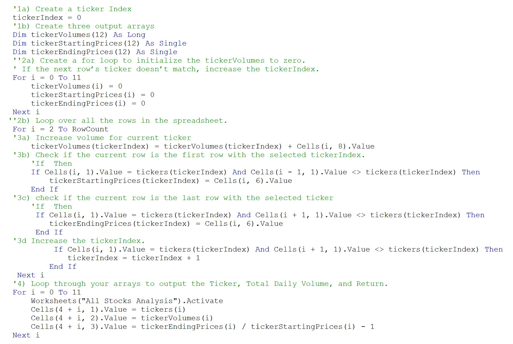

# Stock Analysis (VBA) with Excel
## Overview and Purpose of Project
The intent of this project was to refactor an original code within the VBA coding of Microsoft Excel. In return, I was able to decide if investing in the definitive stock information was worthwhile for my client in the years 2017 and 2018. Originally, the same project was already completed, but resulted in slower coding efficiency. After refactoring the given code, the effciency expelled the same results as a quicker more efficient rate. 
## Results
I included the given refactoring steps listed below, to my original stock analysis VBA coding.

I then inputed the information necessary refactoring the code, to the copied steps.

## The Advantages and Disadvantages of Refactoring Code in General
The advantages of refactoring code makes for user friendly and organized information. When constructing a clearer, easier to read code, debugging is quickly seen and programming and software speeds increase. My client also benifits from code refactoring by means of literacy easibility. Having a code that is to the point and clear, is quicker to gather information. Yet the disadvantages is that, not all codes can be refactored. Because certain programs may be too big or unable to have correct structure and formatting needed to refactor.
## The Advantages and Disadvantages of the Original and Refactored VBA Script
In the original VBA script, the disadvantage as shown below, was a result of slower efficiency. 
